# Article App

A Django-based web application for news article aggregation, analysis, and topic modeling using Natural Language Processing (NLP) techniques.

## Overview

This application scrapes news articles from BBC and Al Jazeera, performs advanced NLP analysis including topic modeling with Latent Dirichlet Allocation (LDA), entity recognition, and sentiment analysis. Users can submit articles, organize them into libraries, and discover similar content based on semantic similarity.

More details: https://docs.google.com/document/d/16Ip6HuSPFbrUHOcCwJEBUI1Lj5dlAobBUQus-cWEElg/edit?usp=sharing

Sentiment analysis part of the project: https://github.com/fabianhoegger/NLP-Data-Exploration

## How It Works

### Architecture

The application is built with the following components:

1. **Django Web Framework**: Serves as the backend framework handling HTTP requests, database operations, and business logic
2. **PostgreSQL Database**: Stores articles, entities, sentiment data, and user libraries
3. **Scrapy Web Scraper**: Automated crawler that extracts articles from BBC and Al Jazeera sitemaps
4. **NLP Pipeline**: Processes article text through multiple stages:
   - **Text Preprocessing**: Tokenization, stopword removal, lemmatization using NLTK and spaCy
   - **Topic Modeling**: LDA model trained on 2000+ articles using Gensim
   - **Entity Extraction**: Named Entity Recognition (NER) to identify people, organizations, and locations
   - **Sentiment Analysis**: Neural network-based sentiment classification using TensorFlow/Keras

### Key Features

1. **Article Scraping & Submission**
   - Automated scraping from BBC and Al Jazeera via Scrapy spiders
   - Manual article submission by URL with automatic content extraction
   - Article preview before adding to database

2. **Topic Modeling with LDA**
   - Trained on 1835-2450 articles with 5-100 topic configurations
   - Uses Gensim library for model training and inference
   - Interactive visualization with pyLDAvis
   - Document similarity using cosine similarity on topic vectors

3. **Entity Recognition & Sentiment**
   - Extracts named entities (people, organizations, locations)
   - Analyzes sentiment towards specific entities within articles
   - Geographic visualization of mentioned places
   - Entity-centric article browsing

4. **User Libraries**
   - Personal collections for organizing articles
   - Add/remove articles to custom libraries
   - User authentication and authorization

5. **Article Discovery**
   - Find similar articles based on topic vectors
   - Browse by entities mentioned
   - View most popular articles by view count

### Technology Stack

- **Backend**: Django 3.1, Python 3.9
- **Database**: PostgreSQL 13
- **NLP/ML**: Gensim, NLTK, spaCy, TensorFlow/Keras, scikit-learn
- **Web Scraping**: Scrapy, BeautifulSoup, lxml
- **Visualization**: Matplotlib, WordCloud, pyLDAvis
- **Frontend**: Django Templates, HTML/CSS

## Docker Setup

### Prerequisites

- Docker installed on your system
- Docker Compose installed

### Running with Docker Compose (Recommended)

The easiest way to run the application is using Docker Compose, which will set up both the Django app and PostgreSQL database:

1. **Clone the repository**
   ```bash
   git clone https://github.com/fabianhoegger/Article_App.git
   cd Article_App
   ```

2. **Build and start the containers**
   ```bash
   docker-compose up --build
   ```

3. **Access the application**

   Open your browser and navigate to: `http://localhost:8000`

   **Note**: The containerized PostgreSQL database will be accessible on port `5433` (not 5432) to avoid conflicts with any local PostgreSQL installation.

4. **Stop the application**
   ```bash
   docker-compose down
   ```

5. **Stop and remove all data (including database)**
   ```bash
   docker-compose down -v
   ```

### Running with Docker Only

If you already have a PostgreSQL database running, you can build and run just the Django container:

1. **Build the Docker image**
   ```bash
   docker build -t article-app .
   ```

2. **Run the container**
   ```bash
   docker run -p 8000:8000 \
     -e DATABASE_HOST=your_db_host \
     -e DATABASE_PORT=5432 \
     -e DATABASE_NAME=articles \
     -e DATABASE_USER=postgres \
     -e DATABASE_PASSWORD=your_password \
     article-app
   ```

3. **Access the application**

   Open your browser and navigate to: `http://localhost:8000`

### Environment Variables

The following environment variables can be configured:

- `DATABASE_HOST`: PostgreSQL host (default: localhost, use 'db' for docker-compose)
- `DATABASE_PORT`: PostgreSQL port (default: 5432)
- `DATABASE_NAME`: Database name (default: articles)
- `DATABASE_USER`: Database user (default: postgres)
- `DATABASE_PASSWORD`: Database password (default: 1776)

### Initial Setup

After the first run, you may want to:

1. **Create a superuser**
   ```bash
   docker-compose exec web python manage.py createsuperuser
   ```

2. **Access the admin panel**

   Navigate to `http://localhost:8000/admin` and login with your superuser credentials

## Local Development Setup (Without Docker)

### Prerequisites

- Python 3.9+
- PostgreSQL 13+

### Installation

1. **Install dependencies**
   ```bash
   pip install -r requirements.txt
   ```

2. **Download NLP models**
   ```bash
   python -m nltk.downloader stopwords punkt vader_lexicon
   python -m spacy download en_core_web_sm
   ```

3. **Configure database**

   Update `main/main/settings.py` with your PostgreSQL credentials or set environment variables

4. **Run migrations**
   ```bash
   cd main
   python manage.py migrate
   ```

5. **Start the development server**
   ```bash
   python manage.py runserver
   ```

6. **Access the application**

   Open your browser and navigate to: `http://localhost:8000`

## Latent Dirichlet Allocation (LDA)

In natural language processing, the latent Dirichlet allocation (LDA) is a generative statistical model that allows sets of observations to be explained by unobserved groups that explain why some parts of the data are similar. For example, if observations are words collected into documents, it posits that each document is a mixture of a small number of topics and that each word's presence is attributable to one of the document's topics. LDA is an example of a topic model and belongs to the machine learning toolbox and in wider sense to the artificial intelligence toolbox.[1]

Plainly explained LDA is an algorithm used for topic modelling that takes as input separate bodies of texts and than categorizes them in a given number of topics based on word appearances. The model creates a vector for each document that than can be used to find similar documents.

The Documents used to train the model are really important and should be close to the application domain in order for the model to have a meaningful result on unseen bodies of text.
### Training

The algorithm should be trained on text without special characters and commonly used words.The model has various parameters to experiment with, the most important one being the number of topics.

### Evaluation

LDA can't be evaluated like using common metrics like accuracy so we would have to test the model ourselves and also use some other metrics unique to the model itself.  Below we are going to be using perplexity and topic coherence to evaluate our models.
There is actually more than one topic coherence kind.
- U-mass
- C_v
- C_p
- C_uci
- C_umass
- C_npmi
- C_a
### Similarity

For Finding similar documents gensim has a similarity class that uses cosine similarity but we will have to see what kind of results it produces.Many people also recommend Jensen-Shannon distance metric.
Some of the possible  similarity metrics are
- Jensen-Shannon
- Hellinger distance
- Kullback–Leibler
- Jaccard

## Visualization

As mentioned above for the creation of the lda model I used the gensim library. For the visualization of the resulting model there is a great library called pyLDAvis.This tool creates an interactive html page with various important data about the model.

### Results

Initially I used 500 articles for my first model and as parameters I set it to num_topics=20, random_state=100,update_every=1, chunksize=100, passes=10, alpha='auto'
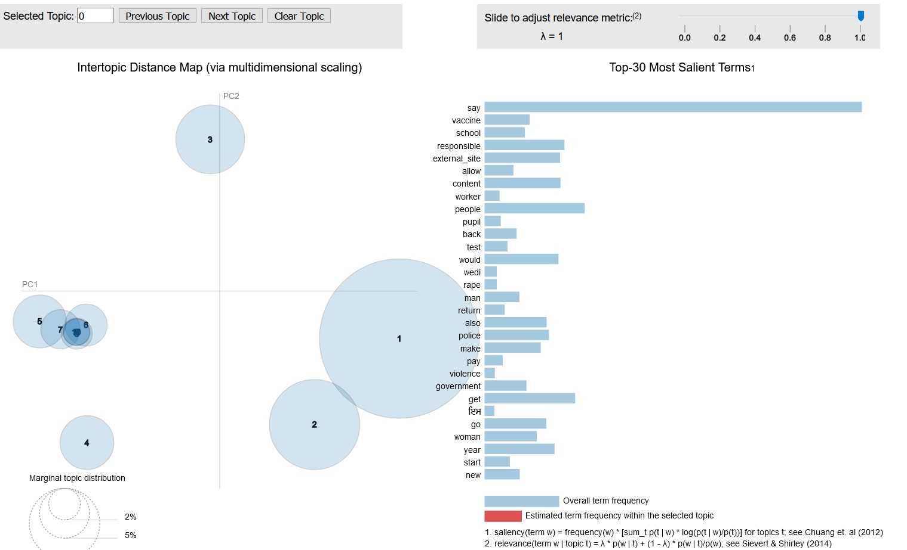
Download the html file [here]( https://github.com/fabianhoegger/Article_App/blob/main/main/properties/lda/lda10/ldavis10.html)

After removing some non english documents I retrained the model on about 350 documents with the same parameters.Here I selected one of the topics to show how the html file works
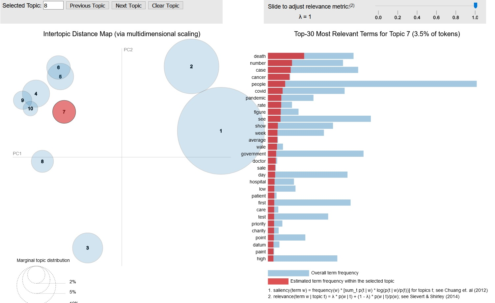
Download the html file [here]( https://github.com/fabianhoegger/Article_App/blob/main/main/properties/lda/lda10/lda10_cleaned/ldavis10clean.html)

Below is the result of the model with the same 500 articles but 20 topics
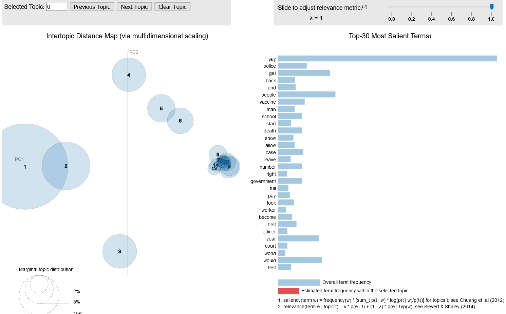
Download the html file [here](https://github.com/fabianhoegger/Article_App/blob/main/main/properties/lda/lda20/ldavis20.html)

Finally I tried training on all the english files I had Scraped
first dividing them in 10 topics and then 20.
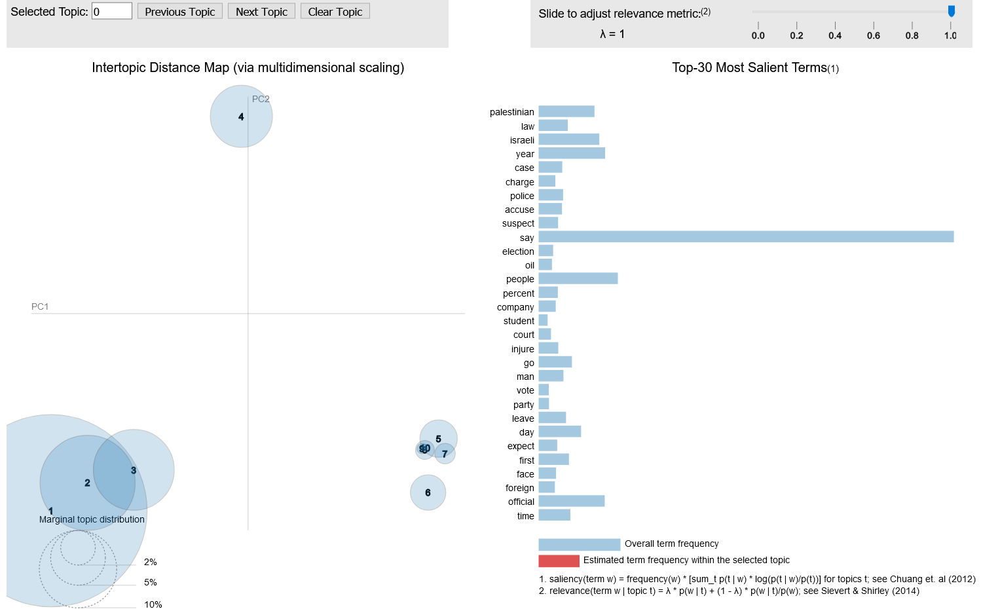
Download the html file [here](hhttps://github.com/fabianhoegger/Article_App/blob/main/main/properties/lda/lda_1835/lda_10_1835/ldavisall.html)
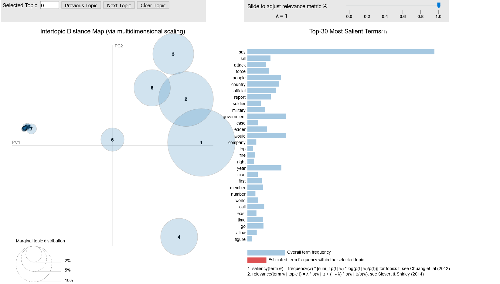
Download the html file [here](https://github.com/fabianhoegger/Article_App/blob/main/main/properties/lda/lda_1835/lda_20_1835/ldavisall20.html)

### Results
>On the first table there are various models with different number of articles and their corresponding perplexity, U-mass coherence and number of topics.
U-mass coherence is better when close to zero and perplexity is optimal at its lowest.

|Model | Perplexity |  U-mass Coherence| Articles |Topics
| -----| ----------  | ----------------|----------|------|
| LDA10 | -8.270   | -9.366|         500|10|
| LDA20 | -13.652  |  -8.049|      500|20|
|lda_10_1835|-8.488| -5.999|      1835|10|
|lda_20_1835 | -12.778| -8.678|   1835|20|

#### Models based on Articles names.
> Because  using U-mass coherence didn't help to distinguish the perfomance of the models for 2450 articles I started using  CV coherence which immediately made things clearer.The higher the cv coherence the better.

|Model | Perplexity |  U-mass Coherence| CV Coherence|Topics
| -----| ----------  | ----------------|----------|----|
|lda_2450|-8.128     | -19.412|0.694| 5|
|lda10_2450|-8.785   |-19.537|0.672|10|
|lda15_2450|-15.156 |-18|0.555|15|
|lda_20_2450|-24.223 |-17.727| 0.556|20|
|lda30_2450|-33.610| -18.760| 0.639 |30|
|lda40_2450|-50.990| -19.720| **0.735**|40|


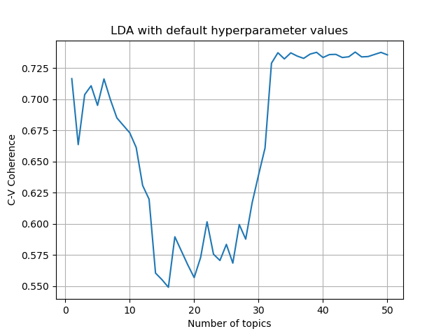

>Coherence along with perplexity

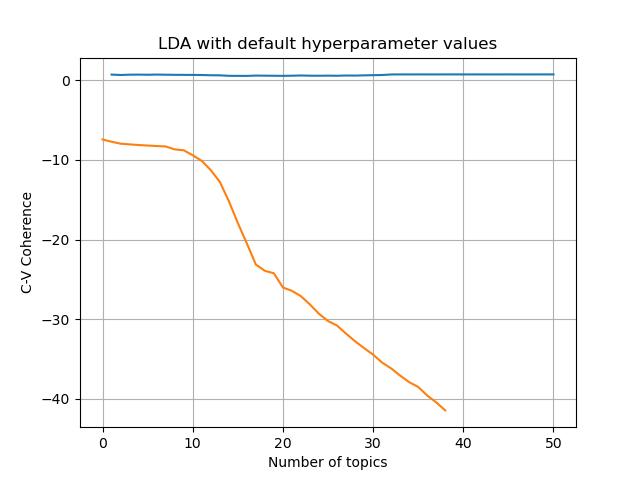
#### Models trained with all the Articles

|Model | Perplexity | CV Coherence|Topics
| -----| ---------- | ------------|------|
|lda_2450|-7.921   |0.352| 5|
|lda10_2450|-8.337 |0.401|10|
|lda15_2450|-11.174 |**0.479**|15|
|lda_20_2450|-12.674|0.467|20|
|lda30_2450|-15.047 |0.401|30|
|lda40_2450|-17.387 |0.418|40|
|lda50_2450|-19.784 |0.420|50|
|lda55_2450|-21.022|0.406|55|
|lda60_2450| -22.208|0.396|60|
|lda70_2450|-24.631|0.349|70|
|lda100_2450|-31.802|0.352|100|
>As we see model coherence maximizes at 15 topics
but the difference is quite minimal. In general we see that the
value of **Perplexity** is not as low as in the models trained only on the article names and **Coherence** is also lower. That might be explained by the fact that now the models are trained on a much bigger corpus.


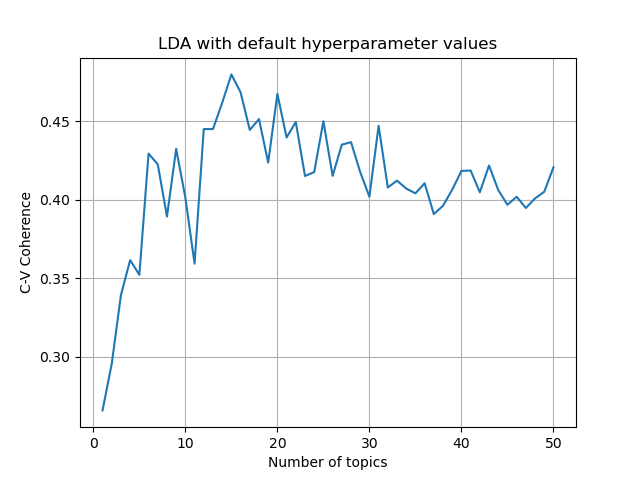

>Coherence along with perplexity shows that perplexity keeps decreasing so we have to try an increased number of topics to see if it ever bottoms out.

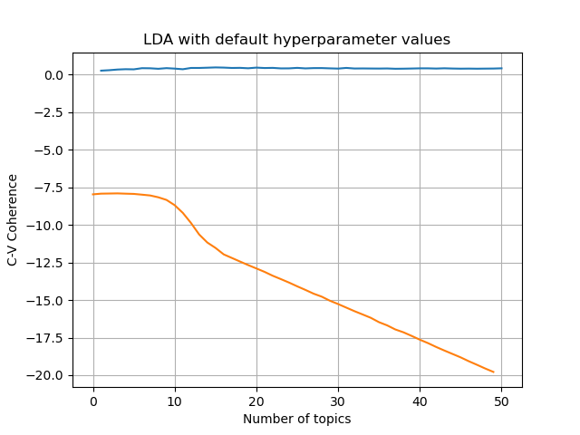


#### Examples

Below I ran some similarity tests using the same Articles for 2 different models.
I classified the articles as **irrelevant** ,**slightly relevant** and **relevant**
The first model was trained  with 15 number of topics (the one from the table above) .
The 2nd was trained with 50 topics for the same articles as the first.


##### Model 1 Topics
Following are some topics with the most frequent words along with a fitting title.
1. Politics/Goverment--Government,say,country,year,also,make,would,leader,election,issue,political,state,
support,lead,new,first,percent,deal,world,last,sanction,need,may,take,power,include,change,seek,public,decisiom
2. Politics/Israel--say,would,year,israeli,tell,time,take,back,come,go,many,want,could,see,leave,palestinian,
day,make,visit,still,know,last,people,peace,give,part,hold,place,also,live
3. Police/Politics--say,woman,report,arrest,police,people,protest,attack,charge,man,official,
group,violence,authority,release,accuse,protester,shoot,die,allegation,suspect,officer,member,detain,victim,intelligence,activist,journalist,kill,investigation
Article given: **Covid-19 in the UK: How many coronavirus cases are there in your area? - BBC News**
##### Model 2 Topics
1. War --say,report,people,kill,attack,military,force,official,group,also,tell,member,call,security,region,war,
leave,least,continue,take,several,statement,come,includee,arly,former,accord,fight,claim,government
2. Politics--political,talk,deal,power,leader,foreign,meeting,peace,government,policy,agree,agreement,
nuclear,seek,international,pressure,trade,reform,state,dispute,minister,maintain,criticise,secretary,labour,settlement,legislation,propose,influence,growth
**MODEL 1**
1. Newcastle city centre £50m revamp plan - BBC News **irrelevant**
2. Covid: Guernsey leaves second pandemic lockdown - BBC News' **relevant**
3. Gold rush threat to Amazon jungle | News News | Al Jazeera **irrelevant**
4. Machine finds tantalising hints of new physics - BBC News **irrelevant**
5. Seen from the sky: Polluted waters around the world | Gallery News | Al Jazeera **irrelevant**
6. COVID jabs bring relief for vulnerable California farmworkers | Agriculture News | Al Jazeera **relevant**
7. Dating agencies boom in China | Arts and Culture News | Al Jazeera **irrelevant**
8. Jinxed Japanese space programme | News News | Al Jazeera **irrelevant**
9. Munching your way through the afternoon | News News | Al Jazeera **irrelevant**
10. Hot tub accidents triple in lockdown, says insurer - BBC News **slightly relevant**


**MODEL 2**

1. Canada quarantines 500 suspected SARS cases | News News | Al Jazeera  **slightly relevant**
2. Covid: Five more in hospital on Isle of Man as 45 new cases confirmed - BBC News **relevant**
3. How the COVID-19 pandemic is affecting mental health | News News | Al Jazeera **relevant**
4. Japan is greying fast | News News | Al Jazeera **irrelevant**
5. Covid: 17 patients treated after Ysbyty Gwynedd outbreak - BBC News' **relevant**
6. 'Covid-19: Brazil to get fourth health minister since pandemic began - BBC News **relevant**
7. Why is India staring at a ‘second peak’ of COVID cases? | Coronavirus pandemic News | Al Jazeera  **relevant**
8. Covid-19: India reports record daily rise in new infections - BBC News **relevant**
9. Russia identifies two cases of South African COVID variant | Coronavirus pandemic News | Al Jazeera **relevant**
10. COVID jabs bring relief for vulnerable California farmworkers | Agriculture News | Al Jazeera **relevant**


>MODEL 1 had  7 **irrelevant**, 1 **slightly relevant**, 2 **relevant**

>MODEL 2 had  1  **irrelevant**, 2 **slightly relevant**, 7 **relevant**


Article given: **School attendance back at high levels in England - BBC News**


**MODEL 1**
1. We were the only people there to support them" - BBC News **irrelevant**
2. Over 50 and overlooked for work' - BBC News **irrelevant**
3. "Covid and cancer: 'It felt like the universe was out to get me' - BBC News **slightly relevant**
4. Nurseries sent first official cyber-attack warning - BBC News  **irrelevant**
5.  "Coronavirus: 'We got through lockdown by dancing' - BBC News"  **relevant**
6. Online privacy: digitally exposed | Science and Technology News | Al Jazeera **irrelevant**
7. Covid in Wales: More face-to-face university teaching after Easter - BBC News  **relevant**
8. Covid-19: Lateral flow testing for years 12-14 pupils - BBC News **relevant**
9. Watch: Freestyle Ski and Snowboarding World Championships - Snowboard Big Air finals - BBC Sport **irrelevant**
10. Covid: Wales' school pupils 'excited and nervous' about return - BBC News  **relevant**


**MODEL 2**
1. Coronavirus: 'Everyone is excited to be back at school' - BBC News **relevant**
2. Nurseries sent first official cyber-attack warning - BBC News **irrelevant**
3. LIVE: Scottish Conservative Party conference speech by Douglas Ross - BBC News **irrelevant**
4. Covid in Wales: More face-to-face university teaching after Easter - BBC News **relevant**
5. Censors hold back Chinese cinema | News News | Al Jazeera **irrelevant**
6. Guernsey's autism centre to move schools over space issue - BBC News **irrelevant**
7. Covid: Outdoor education centres 'may not survive' - BBC News **relevant**
8. Covid-19: Lateral flow testing for years 12-14 pupils - BBC News **relevant**
9. Ipswich aims to become 'UK's first 15-minute' town - BBC News **irrelevant**
10.  Cross-border workers call for home-working tax law - BBC News **irrelevant**


>MODEL 1 had  5 **irrelevant**, 1 **slightly relevant**, 4 **relevant**

>MODEL 2 had  6 **irrelevant**, 0 **slightly relevant**, 4 **relevant**


## Scraping

To scrap bbc and aljazeera I used scrapy's SitemapSpider class that automatically crawls a websites sitemap which is really usefull.
Currently For each article the scraper downloads the page url,title and text body.
[Click here to view the scripts](https://github.com/fabianhoegger/Article_App/tree/main/main/scraper/scraper/spiders).
The scrapy project is connected to my django app and the
Data is stored to a Django postgresql database.
## Website

### Main Page

>The user enters the main page and has the option to read any of the latest articles or navigate the menu
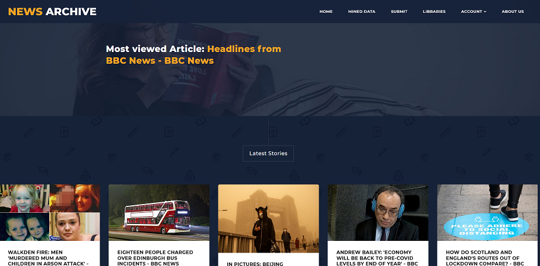

### Submit Page

>To submit an article the user goes to the submit page and inserts the url
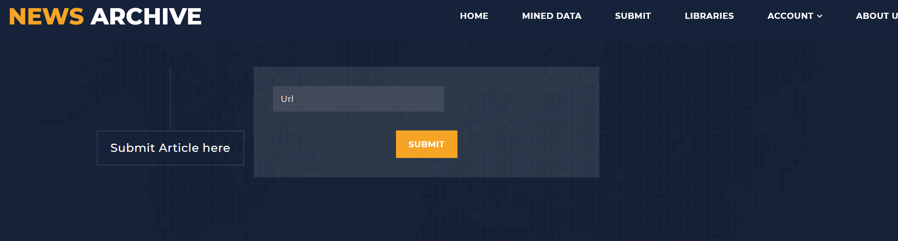

>the app scrapes the url and show the data for the user to process and approve

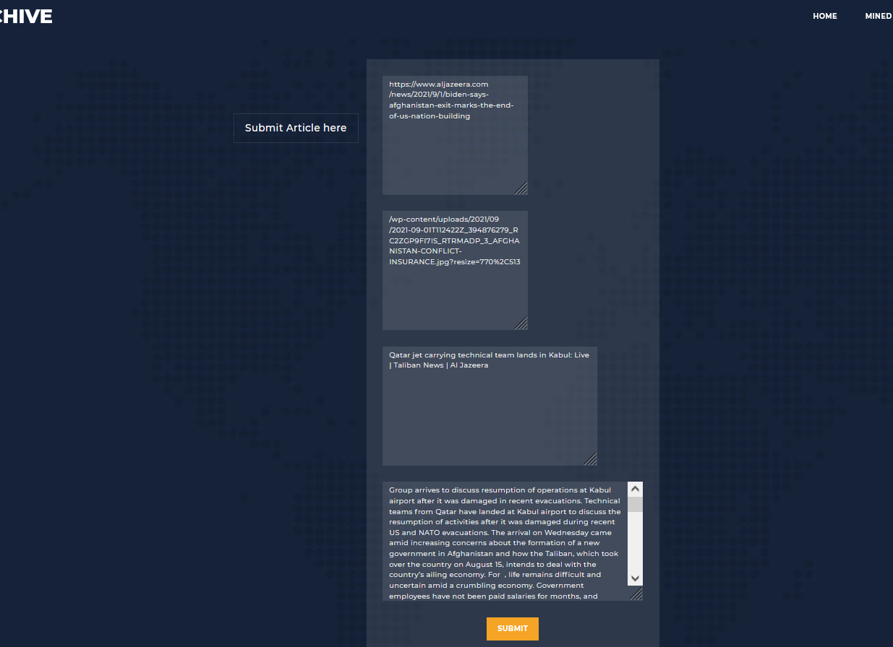
### Libraries

>the user can create libraries and add and remove articles
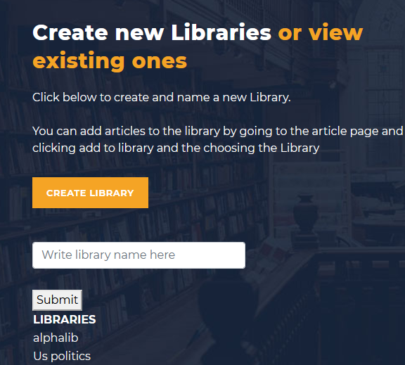

>all users libraries

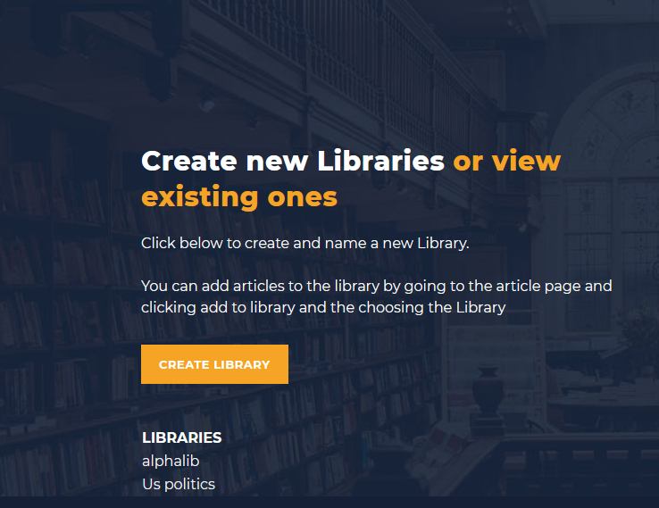

### Data

>In the mined data page the user can see all the entities found in the articles and see where they are mentioned and the sentiment of the text
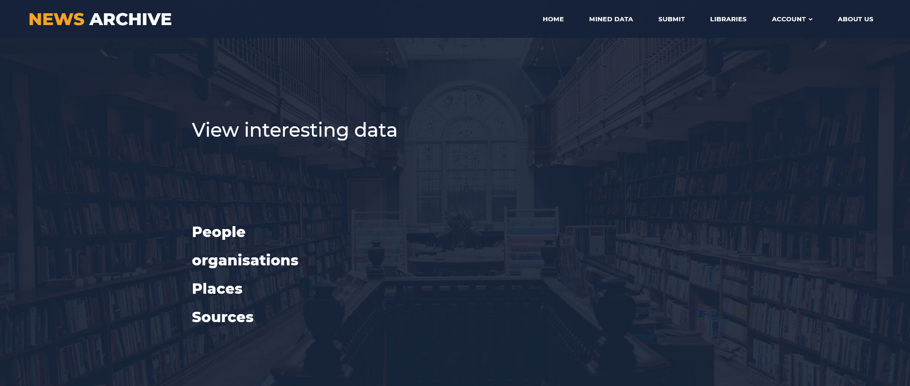

>Clicking on organisations brings all the organisations mentioned 
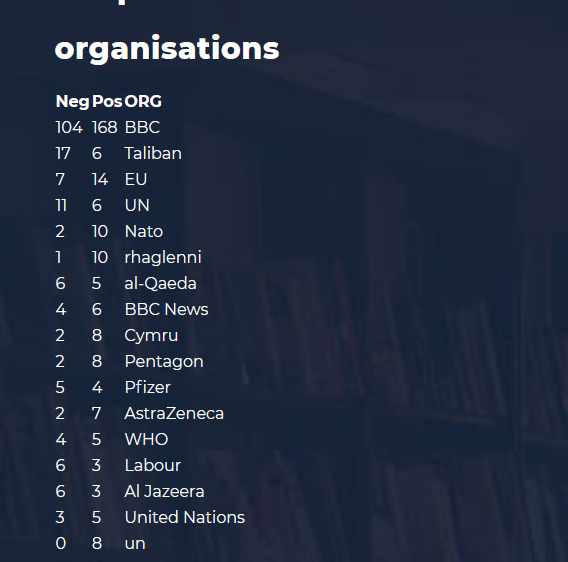

>Places shows a visualisation of all the places mentioned in all the articles
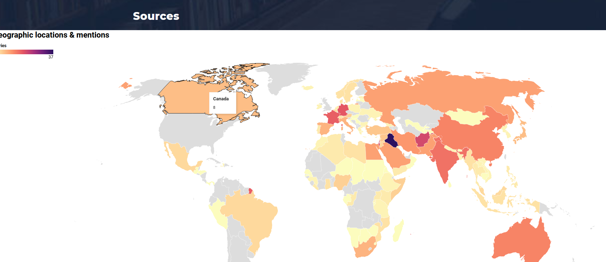

>People show the names of famous people and politicians mentioned in the submitted articles
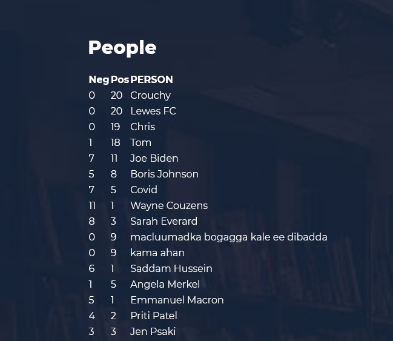

>Clicking on Joe Biden show the articles he is mentioned in and the sentiment of the article towards him
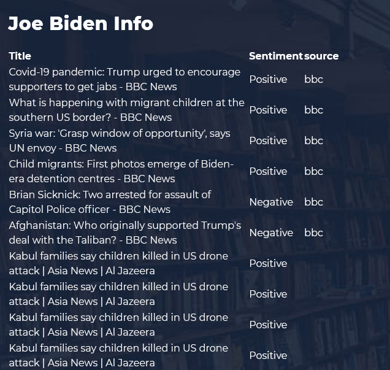
### User Forms
>Users can register and login/logout
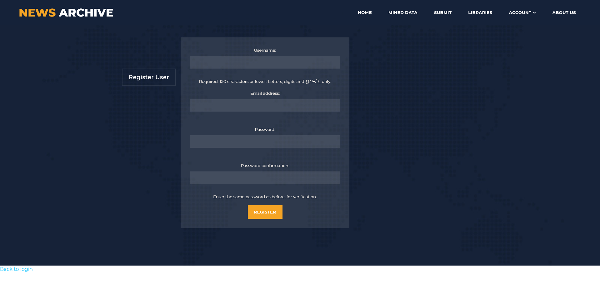

## Links


https://www.analyticsvidhya.com/blog/2016/08/beginners-guide-to-topic-modeling-in-python/
https://datascience.aero/topic-modelling/
http://qpleple.com/perplexity-to-evaluate-topic-models/


https://www.machinelearningplus.com/nlp/topic-modeling-gensim-python/#17howtofindtheoptimalnumberoftopicsforlda


https://www.machinelearningplus.com/nlp/topic-modeling-gensim-python/
https://towardsdatascience.com/lets-build-an-article-recommender-using-lda-f22d71b7143e
https://radimrehurek.com/gensim/similarities/docsim.html
https://radimrehurek.com/gensim/auto_examples/core/run_similarity_queries.html

https://radimrehurek.com/gensim/auto_examples/core/run_corpora_and_vector_spaces.html#sphx-glr-auto-examples-core-run-corpora-and-vector-spaces-py

https://towardsdatascience.com/topic-modelling-in-python-with-nltk-and-gensim-4ef03213cd21

https://medium.com/analytics-vidhya/gensim-lda-topic-modeling-for-article-discovery-9707237e4f0d

https://medium.com/analytics-vidhya/web-scraping-with-scrapy-and-django-94a77386ac1b


https://www.machinelearningplus.com/nlp/topic-modeling-visualization-how-to-present-results-lda-models/

https://miningthedetails.com/blog/python/lda/GensimLDA/
https://groups.google.com/g/gensim
https://rare-technologies.com/what-is-topic-coherence/
