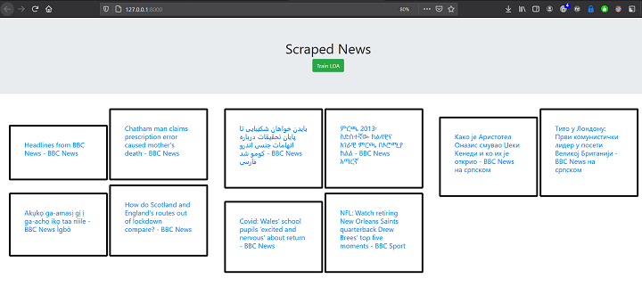

# Article App

Example Article app using django.
Scraped Articles from BBC and Aljazeera using a crawler with the help of the library scrapy.
Trained a LDA model on around 2000 articles for the  purpose of topic modelling using the gensim module.

## Latent Dirichlet Allocation (LDA)

In natural language processing, the latent Dirichlet allocation (LDA) is a generative statistical model that allows sets of observations to be explained by unobserved groups that explain why some parts of the data are similar. For example, if observations are words collected into documents, it posits that each document is a mixture of a small number of topics and that each word's presence is attributable to one of the document's topics. LDA is an example of a topic model and belongs to the machine learning toolbox and in wider sense to the artificial intelligence toolbox.[1]

Plainly explained LDA is an algorithm used for topic modelling that takes as input separate bodies of texts and than categorizes them in a given number of topics based on word appearances. The model creates a vector for each document that than can be used to find similar documents.

The Documents used to train the model are really important and should be close to the application domain in order for the model to have a meaningful result on unseen bodies of text.
### Training

The algorithm should be trained on text without special characters and commonly used words.The model has various parameters to experiment with, the most important one being the number of topics.

### Evaluation

LDA can't be evaluated like using common metrics like accuracy so we would have to test the model ourselves and also use some other metrics unique to the model itself.  Below we are going to be using perplexity and topic coherence to evaluate our models.
There is actually more than one topic coherence kind.
- U-mass
- C_v
- C_p
- C_uci
- C_umass
- C_npmi
- C_a
### Similarity

For Finding similar documents gensim has a similarity class that uses cosine similarity but we will have to see what kind of results it produces.Many people also recommend Jensen-Shannon distance metric.
Some of the possible  similarity metrics are
- Jensen-Shannon
- Hellinger distance
- Kullback–Leibler
- Jaccard

## Visualization

As mentioned above for the creation of the lda model I used the gensim library. For the visualization of the resulting model there is a great library called pyLDAvis.This tool creates an interactive html page with various important data about the model.

### Results

Initially I used 500 articles for my first model and as parameters I set it to num_topics=20, random_state=100,update_every=1, chunksize=100, passes=10, alpha='auto'

Download the html file [here]( https://github.com/fabianhoegger/Article_App/blob/main/main/properties/lda/lda10/ldavis10.html)

After removing some non english documents I retrained the model on about 350 documents with the same parameters.Here I selected one of the topics to show how the html file works

Download the html file [here]( https://github.com/fabianhoegger/Article_App/blob/main/main/properties/lda/lda10/lda10_cleaned/ldavis10clean.html)

Below is the result of the model with the same 500 articles but 20 topics

Download the html file [here](https://github.com/fabianhoegger/Article_App/blob/main/main/properties/lda/lda20/ldavis20.html)

Finally I tried training on all the english files I had Scraped
first dividing them in 10 topics and then 20.

Download the html file [here](hhttps://github.com/fabianhoegger/Article_App/blob/main/main/properties/lda/lda_1835/lda_10_1835/ldavisall.html)

Download the html file [here](https://github.com/fabianhoegger/Article_App/blob/main/main/properties/lda/lda_1835/lda_20_1835/ldavisall20.html)

### Results
>On the first table there are various models with different number of articles and their corresponding perplexity, U-mass coherence and number of topics.
U-mass coherence is better when close to zero and perplexity is optimal at its lowest.

|Model | Perplexity |  U-mass Coherence| Articles |Topics
| -----| ----------  | ----------------|----------|------|
| LDA10 | -8.270   | -9.366|         500|10|
| LDA20 | -13.652  |  -8.049|      500|20|
|lda_10_1835|-8.488| -5.999|      1835|10|
|lda_20_1835 | -12.778| -8.678|   1835|20|

#### Models based on Articles names.
> Because  using U-mass coherence didn't help to distinguish the perfomance of the models for 2450 articles I started using  CV coherence which immediately made things clearer.The higher the cv coherence the better.

|Model | Perplexity |  U-mass Coherence| CV Coherence|Topics
| -----| ----------  | ----------------|----------|----|
|lda_2450|-8.128     | -19.412|0.694| 5|
|lda10_2450|-8.785   |-19.537|0.672|10|
|lda15_2450|-15.156 |-18|0.555|15|
|lda_20_2450|-24.223 |-17.727| 0.556|20|
|lda30_2450|-33.610| -18.760| 0.639 |30|
|lda40_2450|-50.990| -19.720| **0.735**|40|

>Coherence along with perplexity

#### Models trained with all the Articles

|Model | Perplexity | CV Coherence|Topics
| -----| ---------- | ------------|------|
|lda_2450|-7.921   |0.352| 5|
|lda10_2450|-8.337 |0.401|10|
|lda15_2450|-11.174 |**0.479**|15|
|lda_20_2450|-12.674|0.467|20|
|lda30_2450|-15.047 |0.401|30|
|lda40_2450|-17.387 |0.418|40|
|lda50_2450|-19.784 |0.420|50|
>As we see model coherence maximizes at 15 topics
but the difference is quite minimal. WE might consider trying a model with 50 or more topics since the perplexity seems to be steadily decreasing. In general we see that the
value of **Perplexity** is not as low as in the models trained only on the article names and **Coherence** is also lower. That might be explained by the fact that now the models are trained on a much bigger corpus.

>Coherence along with perplexity shows that perplexity keeps decreasing so we have to try an increased number of topics to see if it ever bottoms out.

#### Examples

Below I ran some similarity tests using the same Articles for 2 different models.
I classified the articles as **irrelevant** ,**slightly relevant** and **relevant**
The first model was trained only on names and the second one was trained on whole articles.

Article given:**Pakistan-Afghan fighting ‘ends’**

**MODEL 1**
1. Video: Main course with murderers | AJAM News | Al Jazeera  **irrelevant**
2. NATO may send troops to Palestine | News News | Al Jazeera **slightly relevant**
3. Protesters storm presidential palace in Yemen’s Aden | Protests News | Al Jazeera **relevant**
4. Liverpool Biennial: Outdoor artwork for Covid-safe festival - BBC News  **irrelevant**
5. Baafin-09-Maarso-2021 - BBC News Somali  **irrelevant**
6. Coronavirus: Boris Johnson tells reporters in March 2020 he 'shook hands with everybody' - BBC News  **irrelevant**
7. The Duke of Edinburgh leaves King Edward VII's hospital after treatment - BBC News  **irrelevant**
8. நந்திகிராமில் வாக்காளர்களை கவர புதிய அவதாரம் எடுத்த மமதா - BBC News தமிழ்  **irrelevant**
9. Syria: Kurds fire upon police homes | News News | Al Jazeera **slightly relevant**
10. TV bosses charged over al-Manar | News News | Al Jazeera  **irrelevant**

**MODEL 2**

1. Turkey says civilians wounded in Syrian missile raids | Conflict News | Al Jazeera **slightly relevant**
2. Deaths in Baghdad car bomb | News News | Al Jazeera', **relevant**
3. 'Japan is greying fast | News News | Al Jazeera **irrelevant**
4. Nine held in Spanish police raids | News News | Al Jazeera **irrelevant**
5. السطو على منزل لاعبين في باريس سان جيرمان أثناء مباراة للفريق - BBC News عرب **irrelevant**
6. Child migrants: What is happening at the US border? - BBC News **irrelevant**
7. Sudan calls for rebel leader arrest | News News | Al Jazeera **slightly relevant**
8. Finnish PM quits over leak | News News | Al Jazeera  **irrelevant**
9. Germany expects economic growth | News News | Al Jazeera  **irrelevant**
10. 'Bush tax-cut seen as short-term remedy | News News | Al Jazeera  **irrelevant**

MODEL 1 had  7 **irrelevant**, 2 **slightly relevant**, 1 **relevant**
MODEL 2 had  7  **irrelevant**, 2 **slightly relevant**, 1 **relevant**

Article given: **Rights groups attack Hebron exodus**
1. 'కరోనా వైరస్\u200c సోకినవారిలో కనిపించే లక్షణాలు ఏంటి? ఈ లక్షణాలు కనిపిస్తే ఏం చేయాలి? - BBC News తెలుగు',   **irrelevant**
2.  'Gul faces second presidency vote | News News | Al Jazeera',  **irrelevant**
3.  'David Cameron becomes British PM | News News | Al Jazeera',   **slightly relevant**
4.   'Iraqis ignore  weapons ban | News News | Al Jazeera',   **slightly relevant**
5. "Goldman Sachs boss says 'go extra mile' despite 95-hour week - BBC News",    **irrelevant**
6.   'کشف بزرگترین گور دست جمعی جنگ جهانی اول - BBC News فارسی',   **irrelevant**
7.   'Israel defends Abbas, undermines Arafat | News News | Al Jazeera', **relevant**
8.   "Moira mother's anguish over parallels with Sarah Everard case - BBC News",    **irrelevant**
9.   'Real Madrid v Atalanta - BBC Sport',  **irrelevant**
10. "Mozambik'te 'IŞİD bağlantılı cihatçı militanlar çocukların başlarını kesiyor' - BBC News Türkçe"]  **irrelevant**

1. 'Jersey Constable Chris Taylor must resign, court rules - BBC News', **slightly relevant**
2. UN doctors killed in Afghanistan | News News | Al Jazeera' **slightly relevant**
3. 'Egypt condemns Israeli assassination attempt | News News | Al Jazeera', **slightly relevant**
4. 'Berlusconi faces fresh charges | News News | Al Jazeera',  **slightly relevant**
5. Yemen holds elections | News News | Al Jazeera', **slightly relevant**
6.  'Pentagon ‘delays’ release of Syrian guards | News News | Al Jazeera',  **slightly relevant**
7. When is a shock not a shock? | Italy News | Al Jazeera' **irrelevant**
8. Iran rejects US nuclear censure | News News | Al Jazeera **slightly relevant**
9. Firms battle for Iraq contracts | News News | Al Jazeera'  **slightly relevant**

MODEL 1 had  5 **irrelevant**, 4 **slightly relevant**, 1 **relevant**
MODEL 2 had  1 **irrelevant**, 9 **slightly relevant**, 0 **relevant**

## Scraping

To scrap bbc and aljazeera I used scrapy's SitemapSpider class that automatically crawls a websites sitemap which is really usefull.
Currently For each article the scraper downloads the page url,title and text body.
[Click here to view the scripts](https://github.com/fabianhoegger/Article_App/tree/main/main/scraper/scraper/spiders).
The scrapy project is connected to my django app and the
Data is stored to a Django postgresql database.
## Website

After gathering the articles I created a small website where you can view some article titles and click a button that starts training an lda model.

## Links

https://www.analyticsvidhya.com/blog/2016/08/beginners-guide-to-topic-modeling-in-python/
https://datascience.aero/topic-modelling/
http://qpleple.com/perplexity-to-evaluate-topic-models/

https://www.machinelearningplus.com/nlp/topic-modeling-gensim-python/#17howtofindtheoptimalnumberoftopicsforlda

https://www.machinelearningplus.com/nlp/topic-modeling-gensim-python/
https://towardsdatascience.com/lets-build-an-article-recommender-using-lda-f22d71b7143e
https://radimrehurek.com/gensim/similarities/docsim.html
https://radimrehurek.com/gensim/auto_examples/core/run_similarity_queries.html

https://radimrehurek.com/gensim/auto_examples/core/run_corpora_and_vector_spaces.html#sphx-glr-auto-examples-core-run-corpora-and-vector-spaces-py

https://towardsdatascience.com/topic-modelling-in-python-with-nltk-and-gensim-4ef03213cd21

https://medium.com/analytics-vidhya/gensim-lda-topic-modeling-for-article-discovery-9707237e4f0d

https://medium.com/analytics-vidhya/web-scraping-with-scrapy-and-django-94a77386ac1b

https://www.machinelearningplus.com/nlp/topic-modeling-visualization-how-to-present-results-lda-models/

https://miningthedetails.com/blog/python/lda/GensimLDA/
https://groups.google.com/g/gensim
https://rare-technologies.com/what-is-topic-coherence/
